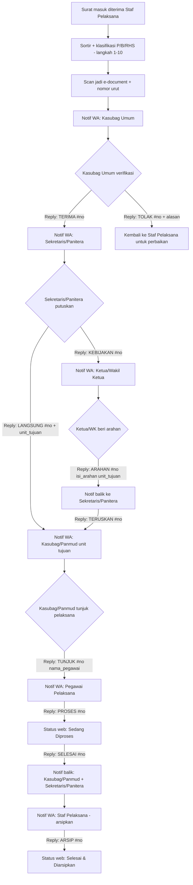

# Plan Alur Disposisi Surat Masuk — Integrasi WhatsApp + Web
## Sesuai SOP/AS/04 PA Pasarwajo langkah 11-18 (rujukan tahap 1-18);
## KMA 131/2023 hanya untuk BAB IV (pengendalian/audit) & BAB V (pengamanan);
## SK Sekma 627/2023 untuk klasifikasi arsip

---

## 0. Kenapa Alur Existing Harus Diubah

Alur existing (surat masuk → notif langsung ke pimpinan → pimpinan pilih pegawai → WA pegawai → "proses"/"selesai") **melompati 3 tahap wajib** di SOP:

- Verifikasi & pencatatan oleh Staf Pelaksana + Kasubag Umum (langkah 4-11)
- Keputusan "perlu kebijakan pimpinan atau tidak" oleh Sekretaris/Panitera (langkah 13)
- Setiap surat otomatis dianggap "perlu kebijakan pimpinan" — padahal SOP hanya mewajibkan itu untuk sebagian surat

Plan ini menata ulang supaya **pimpinan (Ketua/Wakil Ketua) hanya di-notif untuk surat yang memang butuh keputusannya**, sisanya diproses di level Sekretaris/Panitera → Kasubag/Panmud → pegawai pelaksana.

---

## 1. Aktor & Mapping ke Role Sistem

| Aktor SOP | Peran di Alur | Channel Notif |
|---|---|---|
| Staf Pelaksana | Terima, sortir, klasifikasi, catat, scan, arsipkan | Web (input awal), WA (notif tugas arsip akhir) |
| Kasubag Umum | Verifikasi & teruskan ke Sekretaris/Panitera | WA + Web |
| Sekretaris/Panitera | **Decision point utama**: perlu kebijakan Ketua/WK atau tidak | WA + Web |
| Ketua/Wakil Ketua | Beri arahan/kebijakan (hanya utk surat yang butuh) | WA + Web |
| Kasubag/Panmud (unit pelaksana) | Terima arahan final, tunjuk pegawai pelaksana, eksekusi | WA + Web |
| Pegawai Pelaksana | Eksekusi tindak lanjut, lapor status via WA | WA saja (cukup) |

---

## 2. Prinsip Wajib yang Harus Dipegang Agent

1. **Setiap surat wajib lewat Kasubag Umum dan Sekretaris/Panitera dulu** — tidak boleh ada jalur yang skip ke pimpinan langsung, kecuali kasus khusus di poin 3.
2. **Klasifikasi keamanan menentukan isi notifikasi WA**, bukan cuma status. Ini dari BAB V KMA 131 + Lampiran II SK 627 (Hak Akses per level). WA **bukan kanal aman** — jadi:
   - Biasa/Terbatas → boleh kirim ringkasan isi surat di WA.
   - Rahasia/Sangat Rahasia → WA **hanya** notif "Ada surat [SR/R] menunggu tindak lanjut Anda, nomor agenda #xxx" tanpa isi/perihal, wajib buka Web (dengan login) untuk lihat detail.
3. **Cabang "tidak perlu kebijakan" adalah asumsi/interpretasi**, bukan tertulis eksplisit di SOP (SOP hanya eksplisit di jalur "perlu kebijakan"). **Wajib dikonfirmasi ke pimpinan PA Pasarwajo sebelum di-build** — lihat Bagian 7.
4. Semua histori disposisi (siapa, kapan, aksi apa) **harus tersimpan permanen di Web** sebagai audit trail resmi — WA hanya jadi kanal notifikasi & aksi cepat, bukan satu-satunya sumber data. Setiap balasan WA wajib ditulis ulang ke DB sebagai event log, bukan menimpa status begitu saja.

---

## 3. Alur Utama (Flowchart)



---

## 4. State Machine (untuk DB `status_disposisi`)

| Kode Status | Arti | Trigger Masuk |
|---|---|---|
| `DITERIMA` | Surat dicatat staf, belum diverifikasi | Input staf pelaksana selesai |
| `MENUNGGU_VERIFIKASI_KASUBAG_UMUM` | Nunggu Kasubag Umum cek | Notif WA terkirim ke Kasubag Umum |
| `DITOLAK_KASUBAG_UMUM` | Perlu revisi di staf | Reply `TOLAK` |
| `MENUNGGU_KEPUTUSAN_SEKRETARIS` | Nunggu Sekretaris/Panitera putuskan jalur | Reply `TERIMA` dari Kasubag Umum |
| `MENUNGGU_ARAHAN_PIMPINAN` | Eskalasi ke Ketua/WK | Reply `KEBIJAKAN` |
| `ARAHAN_DITERIMA` | Arahan pimpinan sudah masuk, balik ke Sekretaris | Reply `ARAHAN` dari Ketua/WK |
| `DITERUSKAN_UNIT_PELAKSANA` | Sudah di tangan Kasubag/Panmud | Reply `LANGSUNG` **atau** `TERUSKAN` |
| `MENUNGGU_PENUNJUKAN_PEGAWAI` | Kasubag/Panmud belum tunjuk siapa | otomatis saat masuk status di atas |
| `SEDANG_DIPROSES` | Pegawai pelaksana sudah mulai kerja | Reply `PROSES` |
| `SELESAI_DITINDAKLANJUTI` | Substansi kelar, tinggal arsip | Reply `SELESAI` |
| `SELESAI_DIARSIPKAN` | Lembar 1 disposisi balik & diarsipkan (langkah 18) | Reply `ARSIP` dari staf pelaksana |

**Catatan penting**: jangan biarkan status "SELESAI" di web muncul cuma dari 1 kata WA tanpa validasi nomor agenda — selalu match `#no` (nomor urut surat) di setiap reply supaya tidak salah update surat lain kalau 1 orang pegang banyak disposisi aktif sekaligus.

---

## 5. Format Pesan WA per Tahap

### a. Ke Kasubag Umum
```
📨 Surat Masuk Baru #[no_agenda]
Asal: [pengirim]
Klasifikasi: [Biasa/Penting]     <- RHS tidak ditampilkan detailnya
Perihal: [ringkasan]             <- kosongkan jika RHS

Balas:
TERIMA [no_agenda]  → lanjutkan ke Sekretaris/Panitera
TOLAK [no_agenda] [alasan]  → kembalikan ke staf
```

### b. Ke Sekretaris/Panitera
```
📨 Surat #[no_agenda] sudah diverifikasi Kasubag Umum
Perihal: [ringkasan / "Rahasia - buka web"]

Balas:
KEBIJAKAN [no_agenda]  → perlu arahan Ketua/WK
LANGSUNG [no_agenda] [kode_unit]  → langsung ke unit pelaksana, tanpa ke pimpinan
```

### c. Ke Ketua/Wakil Ketua (hanya jika dieskalasi)
```
📨 Surat #[no_agenda] butuh kebijakan Anda
Perihal: [ringkasan / "Rahasia - buka web"]

Balas:
ARAHAN [no_agenda] [isi arahan singkat] [kode_unit_tujuan]
```

### d. Ke Kasubag/Panmud (unit pelaksana)
```
📨 Surat #[no_agenda] perlu ditindaklanjuti unit Anda
Arahan: [isi arahan, jika ada dari pimpinan]

Balas:
TUNJUK [no_agenda] [nama/kode_pegawai]
```

### e. Ke Pegawai Pelaksana
```
📨 Anda ditunjuk menindaklanjuti surat #[no_agenda]
Perihal: [ringkasan]
Arahan: [isi arahan]

Balas:
PROSES [no_agenda]  → status jadi "Sedang Diproses"
SELESAI [no_agenda]  → status jadi "Selesai Ditindaklanjuti"
```

### f. Ke Staf Pelaksana (penutup siklus — langkah 18 SOP)
```
📨 Surat #[no_agenda] sudah selesai ditindaklanjuti.
Silakan tarik lembar 1 disposisi & arsipkan.

Balas:
ARSIP [no_agenda]  → status jadi "Selesai & Diarsipkan" (siklus tutup)
```

---

## 6. Hal Teknis yang Perlu Diperhatikan Agent

1. **Idempotency & validasi nomor**: setiap command WA wajib menyertakan `#no_agenda`; command tanpa nomor atau nomor tidak valid/tidak sesuai role pengirim → tolak, balas error, jangan ubah state apa pun.
2. **Otorisasi nomor WA**: setiap nomor WA harus terikat 1 akun pegawai + role di DB. Kalau nomor WA tidak terdaftar atau reply dari role yang salah (mis. pegawai biasa balas `ARAHAN`), tolak dan log sebagai percobaan tidak sah.
3. **Audit log terpisah dari status**: simpan tabel `disposisi_log` (siapa, waktu, aksi, status_lama, status_baru, channel: WA/Web) — jangan cuma overwrite 1 kolom status. Ini juga selaras dengan BAB IV KMA 131 soal bukti penyampaian naskah dinas (harus ada nomor urut, tanggal, asal, isi ringkas, unit tujuan, waktu, & nama penerima — field-field ini persis yang perlu direkam di log).
4. **Reminder/SLA** (di luar SOP, saran tambahan): kalau status diam >X jam di satu tahap, kirim reminder WA otomatis ke pemegang tahap tsb. SOP tidak mengatur SLA waktu per tahap secara eksplisit (hanya total waktu 135 menit untuk keseluruhan proses versi manual), jadi angka SLA ini kebijakan internal, bukan aturan MA — perlu ditentukan sendiri oleh pimpinan.
5. **Fallback kalau WA gagal/nomor ganti**: tetap harus bisa dilakukan manual lewat web oleh masing-masing role, supaya alur tidak macet total kalau WA down.
6. **RHS tidak boleh auto-forward isi lewat WA** dalam bentuk apa pun (termasuk lampiran/gambar) — hanya notifikasi keberadaan surat, isi wajib dibuka via web dengan autentikasi + izin akses sesuai Lampiran II SK 627.

---

## 7. Yang WAJIB Dikonfirmasi ke Pimpinan PA Pasarwajo Sebelum Build

Bagian ini **bukan** dari SOP/SK MA — ini asumsi yang dipakai di plan ini dan perlu persetujuan eksplisit karena SOP sumbernya tidak menulisnya secara gamblang:

1. **Kriteria "perlu kebijakan" vs "langsung"** — SOP tidak mendefinisikan kriteria surat mana yang perlu naik ke Ketua/WK dan mana yang tidak. Perlu daftar kriteria konkret dari Sekretaris/Panitera (mis. berdasarkan jenis surat, pengirim, atau nilai/dampak) supaya bisa dijadikan pilihan `KEBIJAKAN` vs `LANGSUNG` yang konsisten, bukan keputusan ad-hoc tiap kali.
2. **Siapa yang berwenang menunjuk pegawai pelaksana** — plan ini menaruhnya di Kasubag/Panmud (karena SOP menyebut Kasubag/Panmud sebagai "unit pelaksana"), tapi kalau alur existing pimpinan yang biasa memilih langsung, ini perubahan wewenang yang perlu disetujui, bukan cuma perubahan teknis aplikasi.
3. **Isi surat Rahasia/Sangat Rahasia lewat WA** — pastikan pimpinan setuju bahwa WA sama sekali tidak boleh membawa isi/lampiran untuk level ini, hanya notifikasi kosong + link ke web.

---


---

## 9. Status implementasi (Fase 0–4) — sesi 24 Sep 2026

Bagian ini mencatat apa yang **sudah berjalan di kode** dari rencana di atas, plus
keputusan yang diambil saat implementasi. Rincian asumsi & bukti perintah ada di
`docs/CATATAN_ASUMSI_REVISI.md` bagian 8.

### 9a. Yang sekarang terjadi otomatis (keputusan #1 = opsi C)

| Kejadian | Sebelum | Sesudah |
| --- | --- | --- |
| Pelaksana menandai **PROSES** (web `PATCH /dispositions/:id/status` atau balasan WA `1`) | hanya baris `dispositions.status` berubah | tahap surat **naik** ke `DALAM_TINDAK_LANJUT` (log kendali `AUTO_STAGE`) |
| Pelaksana menandai **SELESAI** | idem | tahap surat naik ke `SELESAI_DITINDAKLANJUTI` (bisa dua langkah sekaligus bila PROSES tak pernah dilaporkan) |
| Sekretaris/Panitera mengubah tahap dari Buku Kendali | tulis sendiri di `control.php` | lewat kelas yang sama (`LetterTransition`) + notifikasi WA per tahap |
| Laporan dari surat yang belum sampai rantai pelaksana | — | **tidak** memajukan tahap; alasannya dikembalikan (`BUKAN_TAHAP_PELAKSANAAN`) |
| Kasubag Umum salah menunjuk pelaksana | tidak ada jalan koreksi | tombol **Tarik kembali** → `POST /api/control/:id/reopen`, alasan wajib ≥ 10 karakter, surat kembali ke `DITERUSKAN_KE_KASUBAG`, dicatat `STAGE_REOPEN` |
| `MENUNGGU_PENGARSIPAN → DIARSIPKAN` | manual | **tetap manual** (tidak diubah) |

### 9b. WhatsApp sekarang (keputusan #2 = opsi A)

- Pemegang tahap baru menerima **dua** pesan DM: pemberitahuan tahap
  (`Wabot::buildStageNoticeText`) + **menu aksi bernomor**
  (`Wabot::buildStageTaskMenu`). Isi pilihan dibangun dari
  `V2Workflow::allowedTransitionsFor()` milik masing-masing penerima, jadi menu
  tidak pernah menawarkan aksi yang akan ditolak server.
- Jenis sesi baru di `wa_sessions`: **`VERIFIKASI`** (penerusan/pengarahan surat),
  **`DEKISION`** (menunggu/menembus keputusan rute), **`ARCHIVE`** (pengarsipan),
  berlaku 72 jam (`Wabot::STAGE_SESSION_HOURS`), satu **antrean** maksimum 5 tugas.
- Untuk pilihan yang memerlukan keputusan rute, balasan ditulis menyatu:
  `1 KEBIJAKAN [catatan]` atau `1 LANGSUNG [catatan]` (parser `parseRouteChoice()`).
- Role yang boleh bertindak dari menu: `ADMIN`, `KEPALA_SUB_UMUM`, `SEKRETARIS`,
  `PANITERA` (`Wabot::STAGE_ACTOR_ROLES`). Pimpinan **menerima notifikasi** tetapi
  belum punya tombol "TERUSKAN" (lihat H1) — perintah teks v1 tetap milik
  `PIMPINAN`/`ADMIN` (`Wabot::ALLOWED_ROLES` tidak berubah).
- Surat `RAHASIA`/`SANGAT_RAHASIA`: notifikasi hanya menyebut keberadaan naskah
  ("[RAHASIA] agenda ..."), perihal tidak dikirim (KMA 131 BAB V), dan aksi dari WA
  ditolak dengan arahan ke web.
- Daftar pegawai pada menu "buat disposisi" kini mengikuti wewenang:
  bawahan langsung (`users.supervisor_id`) untuk Kasubag/Sekretaris/Panitera, semua
  pegawai untuk ADMIN/PIMPINAN. Kolom **Atasan Langsung** sudah bisa diisi dari
  menu Pengguna (sebelumnya mustahil dari UI, sehingga wewenang hierarkis mandek).

### 9c. Yang belum dikerjakan dari rencana di atas

- Pimpinan belum bisa menekan "TERUSKAN" dari WA (H1) dan balasan WA masih wajib
  bernomor (H6).
- Belum ada cabut/pindah tugas (`dispositions`) — koreksi lewat penarikan Kasubag.
- Peta role→tahap dan aturan penarikan masih berstatus **draf** untuk diratifikasi
  (`V2Workflow::RATIFICATION_NOTICE`).
- Pengiriman WhatsApp belum diuji dengan nomor perangkat nyata (semua uji memakai
  stub pengirim).


- SOP/AS/04 — Penanganan Surat Masuk PA Pasarwajo (khususnya langkah 11-18)
- KMA No. 131/KMA/SK/VII/2023 — BAB IV (Pengendalian Naskah Dinas) & BAB V (Pengamanan Naskah Dinas)
- SK Sekretaris MA No. 627/SEK/SK/VII/2023 — Lampiran II (Sistem Klasifikasi Keamanan dan Akses Arsip)
